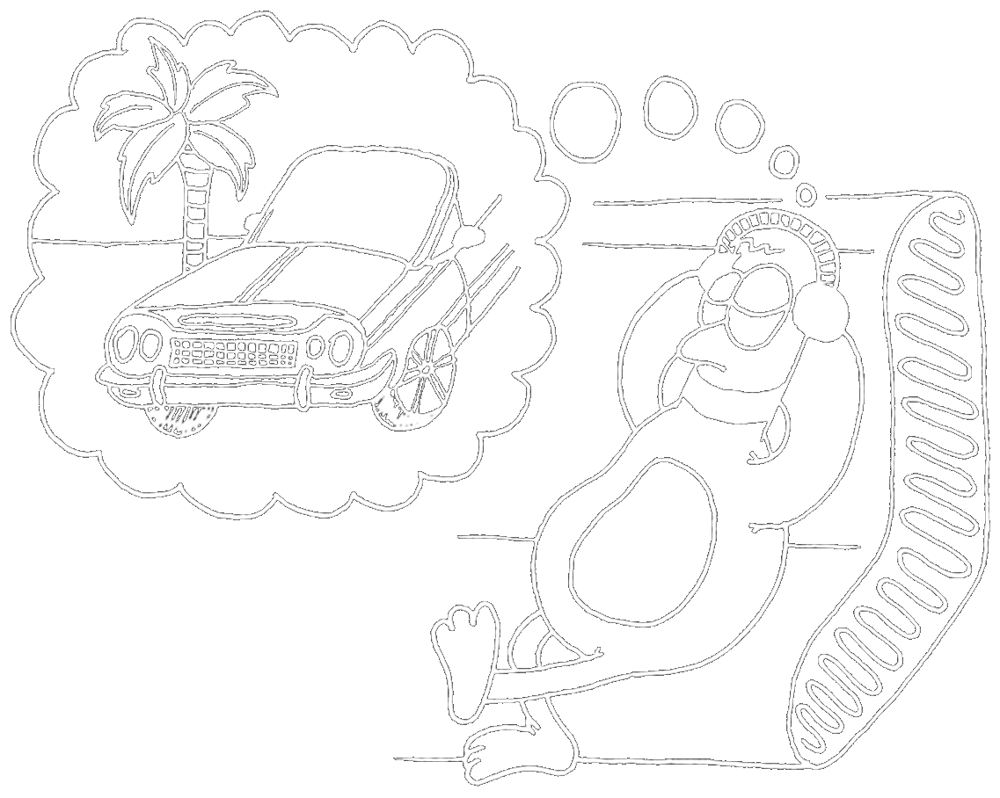
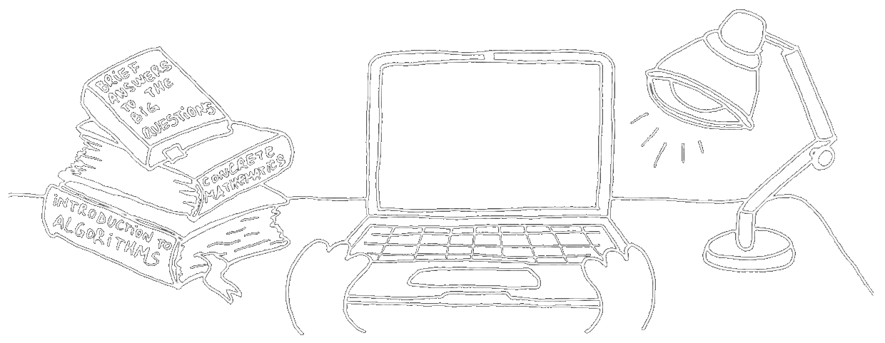

import SocialLinks from '../../components/home/SocialLinks.astro'

## 🦆 Who Am I?

My name is **Iulian Oleniuc**, I'm {new Date() < new Date(new Date().getFullYear(), 2, 21) ? new Date().getFullYear() - 2003 : new Date().getFullYear() - 2002} years old, and I **just** graduated with a Master's degree in Advanced Studies in Computer Science from Alexandru Ioan Cuza University of Iași. My research focused on cryptography, specifically on **Key-Policy Attribute-Based Encryption**. I'm passionate about mathematics, science, and hip-hop culture.

Outside of university, I spend my time on algorithmic activities --- writing for InfoGenius, teaching at InfoGym, organizing FIICode, participating in NOI committees, and preparing students for competitions. I also enjoy reading Eric Schmitt and reflecting on the great thinkers of history. From time to time, I find myself doing web development, working on sites like this one. Depending on the season, I also like to go cycling or take the occasional trip.

## 🔬 What Have I Done?

- In high school, I won a silver 🥈 and a bronze 🥉 medal at **NOI** (National Olympiad in Informatics).
- For 4 years, I conducted lessons at the **InfoGym** computer science circle.
- For 4 years, I was a member of the scientific committee of the **FIICode** contest.
- For 1 year, I served as a member of the **scientific committee** of NOI (6th-grade level).
- For 1 year, I provided **training** in computer science for NOI and university admissions.
- For 1 semester, I taught **Algorithm Design** to two groups.
- I coached at two **ICPC** training camps in Osijek, Croatia, and Wrocław, Poland.
- I served as a coach at **SEERC 2024** in Bucharest.
- I developed the website of the [**Iași Red Cross**](https://crucearosieiasi.ro/).
- I participated in an **Erasmus+** program in Baena, Spain.

## 🔗 Helpful Links

<SocialLinks />
