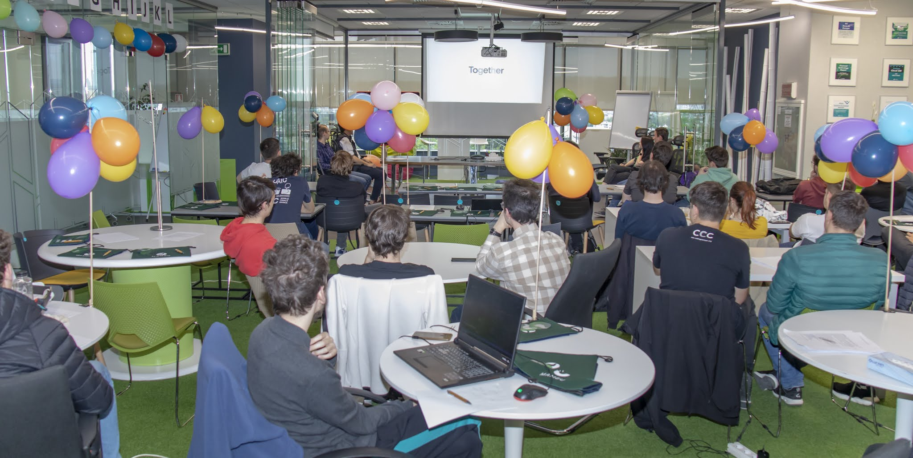

For almost a month now, I've wanted to write a post on this topic, but it wasn't until the day before yesterday that I finally finished coding the blog. 2023 wasn't my best or most extraordinary year, but I'm pretty sure it was the busiest one.

## 🐌 Career

First of all, in 2023, I graduated from the prestigious Computer Science faculty in the heart of Moldova (the one in Romania). I went through the last and most stressful semester, culminating in the much-anticipated presentation of my bachelor's thesis. The thesis was based on a [paper](https://arxiv.org/abs/2305.13008) submitted to a B-ranked cryptography conference, which somehow got accepted. It saddens me a little to think that no one will ever look at [it](https://ioleniuc.ro/paper/thesis-paper.pdf) again, considering it's much more detailed and clear than the conference paper itself. The latter was written quickly and as part of a team, whereas for my thesis, I worked intensively for an entire month.

Regarding teaching, in addition to starting my third year of teaching at InfoGym, I also held my first classes at university: two lab sessions in IP (Introduction to Programming) and a lecture in CP (Competitive Programming). Furthermore, after many refusals on my part, I agreed for the first time this year to coach someone for the National Olympiad, and I actually enjoy it.

When it comes to web dev, I can hardly believe it, but this year I finally finished the website for the [Iași Red Cross](https://crucearosieiasi.ro/). I also worked on a project --- let's say in the financial domain --- that I'm really looking forward to finish. On top of that, I created a tool I use daily for note-taking, called [PasteMd](https://pastemd.netlify.app/) (PasteBin but for Markdown). In 2023, I learned SCSS, TypeScript, GraphQL, Supabase, and even a little bit of [WASM](https://github.com/gareth618/numerical-analysis) (I ran Python code in WebAssembly!) and [MongoDB](https://github.com/gareth618/music-app).

## 🏟️ Contests

As for competitions, which I normally don't care much about anymore, I can proudly boast of two achievements. First, I took 1st place at ISCPC (the famous international programming competition for students, with a tradition of over 40 years, bringing together students from over 100 countries --- the stage in Iași)! This success is largely thanks to the absence of high school teams, who typically crush even the most seasoned students.

Then, I won 1st place at my faculty in an AI competition (Cloudflight Coding Contest), all on my own, even beating friends who already have a respectable amount of experience (over 12 months!) in the industry. I won thanks to a three-line neural network, even though the most advanced concept I know in this field is [backpropagation](https://ioleniuc.ro/paper/neural-networks.pdf).

## 🎭 Culture

2023 was probably the busiest year in terms of reading, although I read far less frequently than I would've liked. I managed to get through 9 books --- a mix of literature and a lot of Eric Schmitt.

I watched [59 movies](https://letterboxd.com/gareth618/films/diary/for/2023/) and 4 TV shows: Rick and Morty (I had to find out what the hype was about), Gravity Falls (I watched season 1 about 10 years ago, was a big fan back then, so I decided to finish it --- totally worth it), Ted Lasso, and Big Little Lies (both absolutely superb).

## 🚂 Trips

This year, I went on an incredible number of trips (out-of-town travels) --- 9 in total, with only one of them being with my family! I also went on my very first solo trip, where I had a blast exploring Cluj, enjoying fine dining, and hiking in the Turda Gorge. Another new experience was finally visiting the capital.

- Piatra-Neamț
- Vatra Dornei
- Vaslui (Open Camp Vaslui)
- Suceava
- Tecuci (business trip)
- Vama Veche (Sunset Festival)
- Cluj
- Tecuci (wedding of a friend)
- București

## 🎤 RAP Concerts

I went to the Sunset Festival, where I saw CTC, Studiou' P, and many others (with whom I'm less familiar) for the first time, and Specii for the second time. It was an unforgettable experience at all three performances.

One evening during my trip to the capital, I attended the pre-launch of the album 1000 Waves by Faust & Nu'. There were only about 30 people there. It was at least interesting to be so close to my favorite rappers, and I even stood right next to David Skunk in the crowd. Too bad I couldn't stay for the afterparty.

## ✨ Personal

In 2023, I got involved in all sorts of social activities: cinema, theater, opera, ping-pong, billiards, padel, tennis, running, and playing backgammon (I'm not really into chess or other nerdy games). And I made a new friend!

I gave my first speech in front of a truly large audience --- the auditorium of my former high school. I spoke, with concrete examples, about the importance of deeply and intuitively understanding what we learn in math and computer science. I wanted it to be something different from the usual "competitions help your career" spiel.

I also learned to empathize better with people, to be more selective with what I let bother me, not to expect anything from others, to step out of my comfort zone more easily, to be less of a perfectionist, to better argue my points of view, and to love myself a bit more.

## 🎆 Resolutions for 2024

Right now, I know that this year I'll be heading to Croatia soon for an ICPC camp, where I'll be a coach. I also know that in the second semester, I'll be teaching the Algorithm Design seminar to two groups and a third of the Competitive Programming lectures, where I hope to do a good job. As for the rest, my main plans are:

- ~~1000 km on my bike~~ (abandoned --- switched to running)
- 15 trips (out of Iași)
- 25 books (fiction and non-fiction)
- 10 RAP concerts (which will likely involve a lot of trips to Bucharest)
- Getting back to the [InfoGenius](https://infogenius.ro/) project and taking it to greater heights.
