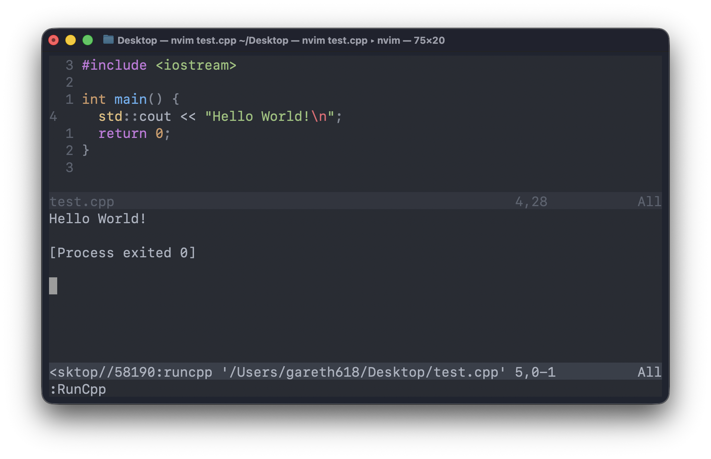

import CodeBlockHeader from '../../components/general/CodeBlockHeader.astro'

After finally managing to create the perfect all-encompassing ESLint config for my blog repository, I've decided to write a little post in order to share all the relevant dev configs I use on a daily basis.

But first, how does my dev setup look like?

## 🪐 General Setup

I work on a MacBook Air 2020 --- I think it was the first model ever released with an Apple M1 chip. I am more than happy to switch to a GNU/Linux system if I have to, but I would miss the macOS key bindings. However, I'm still hostile towards Windows, which I have to use daily on my actual job. To be honest, it has copied enough things from macOS lately that it became somewhat decent to use, and it actually beats macOS when it comes to most aspects of window management. But PowerShell is a hell.

I use the native Terminal app, which starting with macOS Tahoe added true-color support. Previously, I had to use iTerm2 for Neovim's syntax highlighting.

The only shell I use is [Fish](https://fishshell.com/). Colorful, great autocomplete support, nice Git integration (e.g., it displays the current branch name in the right side of the command line). [Nushell](https://www.nushell.sh/) seems cool too, but not being POSIX-compliant scares me a bit.

My text editor of choice is VSCode. I've also tried [Neovim](https://neovim.io/) a year ago. It's really cool, but I just don't have the time (and, therefore, neither the motivation) to learn all the necessary key bindings or to turn it into a full-fledged IDE for my very specific needs. I kept it as the default text editor for Git commit messages though, so I don't forget its basics.

Favourite tech stack? [Astro](https://astro.build/) + [Vue](https://vuejs.org/) + [Tailwind](https://tailwindcss.com/). I have never done enough backend work on my personal projects, but if I'd have to choose an Auth + DB system, that would be [SupaBase](https://supabase.com/). For algorithmic stuff, such as competitive programming, I use(d) C++.

## 🐟 Fish

<CodeBlockHeader title="~/.config/fish/config.fish" />

```sh
function runcpp --argument filename
  clang++ -std=c++20 -Wall -Wextra $filename && ./a.out && rm a.out
end
```

Here we have a Fish function compiling, running, and cleaning after the given C++ file.

## 🔮 Neovim

<CodeBlockHeader title="~/.config/nvim/init.lua" />

```lua
require('plugins')

vim.opt.number = true
vim.opt.relativenumber = true

vim.opt.tabstop = 2
vim.opt.shiftwidth = 2
vim.opt.expandtab = true
vim.opt.autoindent = true

vim.opt.linebreak = true
```

Basic indentation setup.

<CodeBlockHeader title="~/.config/nvim/lua/plugins.lua" />

```lua
return require('packer').startup(function(use)
  use 'wbthomason/packer.nvim'
  use {
    'nvim-treesitter/nvim-treesitter',
    run = ':TSUpdate',
    config = function()
      require'nvim-treesitter.configs'.setup {
        ensure_installed = { "lua", "python", "javascript", "html", "css", "c" },
        highlight = { enable = true },
        indent = { enable = true },
        incremental_selection = { enable = true },
      }
    end
  }
  use {
    'navarasu/onedark.nvim',
    config = function()
      require('onedark').setup {
        style = 'dark',
      }
      require('onedark').load()
    end
  }
  vim.api.nvim_create_user_command('RunCpp', function()
    local file = vim.fn.expand('%:p')
    vim.cmd('below split | terminal runcpp ' .. vim.fn.shellescape(file))
  end, {})
end)
```

Basic syntax highlighting for the languages I really need. Just as inside VSCode, I use the Atom One Dark theme. I've also defined a Vim command which opens a new terminal tab below the currently opened C++ file and runs the above Fish function on it. Ain't that cool?



> 💭 That's precisely the context in which I want to continue learning Neovim --- coding in C++ and creating the best setup for competitive programming. Coding in C++ for what, you ask? For preparing the source files which will be shown on [AlgoGenius](https://algogenius.ro/).

## 🪟 VSCode

<CodeBlockHeader title="keybindings.json" />

```json
[
  {
    "key": "ctrl+`",
    "command": "workbench.action.terminal.focus"
  },
  {
    "key": "ctrl+`",
    "command": "workbench.action.focusActiveEditorGroup",
    "when": "terminalFocus"
  },
  {
    "key": "ctrl+f",
    "command": "workbench.action.toggleMaximizedPanel"
  },
  {
    "key": "ctrl+h",
    "command": "workbench.action.togglePanel"
  },
  {
    "key": "ctrl+k",
    "command": "workbench.action.terminal.kill"
  },
  {
    "key": "ctrl+n",
    "command": "workbench.action.terminal.split"
  }
]
```

I need key bindings to kill a terminal, focus on it, close it, hide it, make it full-screen, and split it.

<CodeBlockHeader title="settings.json" />

```json
{
  "[latex]": { "editor.wordWrap": "on" },
  "[markdown]": { "editor.wordWrap": "on" },
  "[mdx]": { "editor.wordWrap": "on" },
  "[plaintext]": { "editor.wordWrap": "on" },

  "C_Cpp.default.compilerPath": "/usr/bin/clang++",
  "C_Cpp.default.cppStandard": "c++20",
  "C_Cpp.default.includePath": ["/usr/local/include/"],
  "C_Cpp.default.intelliSenseMode": "macos-clang-arm64",

  "editor.codeActionsOnSave": {
    "source.fixAll.stylelint": "explicit",
    "source.fixAll.prettier": "explicit"
  },
  "editor.cursorStyle": "block",
  "editor.defaultFormatter": "esbenp.prettier-vscode",
  "editor.fontSize": 20,
  "editor.formatOnSave": true,
  "editor.minimap.enabled": false,
  "editor.stickyScroll.enabled": false,
  "editor.tabSize": 2,

  "gitlens.codeLens.enabled": false,
  "gitlens.plusFeatures.enabled": false,
  "gitlens.rebaseEditor.openOnPausedRebase": false,

  "terminal.integrated.fontSize": 18,
  "terminal.integrated.initialHint": false,
  "terminal.integrated.shellIntegration.decorationsEnabled": "never",
  "terminal.integrated.stickyScroll.enabled": false,
  "terminal.integrated.suggest.enabled": false,

  "window.customTitleBarVisibility": "windowed",
  "window.commandCenter": false,
  "window.zoomLevel": -2,

  "workbench.colorTheme": "Atom One Dark",
  "workbench.editor.empty.hint": "hidden",
  "workbench.iconTheme": "material-icon-theme",
  "workbench.productIconTheme": "bongocat",
  "workbench.secondarySideBar.defaultVisibility": "hidden",
  "workbench.startupEditor": "none",
  "workbench.tree.enableStickyScroll": false,
  "workbench.tree.indent": 20,

  "debug.console.fontSize": 18,
  "extensions.ignoreRecommendations": true,
  "markdown.preview.fontSize": 20,
  "security.workspace.trust.enabled": false
}
```

Except for HTML, which is full of indentations, the prose-oriented files should word-wrap. On file save, all available StyleLint and Prettier fixes, respectively, should be applied. I want the editor to remain as minimalistic as possible, so I don't need minimaps, sticky-scrolls, and so on in my life. From GitLens I only make use of CodeLens --- that is, mainly, displaying onto each line of code who authored it.

## 🖌️ StyleLint

<CodeBlockHeader title=".stylelintrc.cjs" />

```cjs
module.exports = {
  extends: [
    'stylelint-config-standard',
    'stylelint-config-html',
    'stylelint-config-tailwindcss',
    'stylelint-config-recess-order',
  ],
  overrides: [
    {
      files: ['**/*.astro', '**/*.vue'],
      customSyntax: 'postcss-html',
    },
  ],
}
```

Support for Astro, Vue, Tailwind, and HTML. Its main goal, for me, is reordering the CSS properties in a deterministic, consistent way --- apparently, called "Recess."

## ✨ Prettier

<CodeBlockHeader title=".prettierrc" />

```json
{
  "plugins": ["prettier-plugin-astro", "prettier-plugin-tailwindcss"],
  "overrides": [
    {
      "files": "*.astro",
      "options": {
        "parser": "astro"
      }
    },
    {
      "files": "*.vue",
      "options": {
        "parser": "vue"
      }
    }
  ],
  "arrowParens": "avoid",
  "semi": false,
  "singleQuote": true
}
```

Support for Astro, Vue, and Tailwind. No parentheses for one-argument arrow functions. No trailing semicolons. Trailing commas everywhere. Single quotes.

## ☘️ ESLint

<CodeBlockHeader title="eslint.config.js" />

```mjs
import astro from 'eslint-plugin-astro'
import { defineConfig } from 'eslint/config'
import globals from 'globals'
import js from '@eslint/js'
import prettier from 'eslint-config-prettier/flat'
import ts from 'typescript-eslint'
import tsParser from '@typescript-eslint/parser'
import vue from 'eslint-plugin-vue'

export default defineConfig([
  js.configs.recommended,
  ...ts.configs.recommended,
  ...astro.configs['flat/recommended'],
  ...vue.configs['flat/recommended'],
  prettier,
  {
    languageOptions: {
      globals: globals.browser,
    },
  },
  {
    files: ['**/*.vue'],
    languageOptions: {
      parserOptions: {
        parser: tsParser,
        ecmaVersion: 'latest',
        sourceType: 'module',
      },
    },
  },
  {
    files: ['**/*.cjs'],
    languageOptions: {
      sourceType: 'commonjs',
      ecmaVersion: 'latest',
    },
  },
  {
    rules: {
      'prefer-const': 'error',
      'sort-imports': ['error', { allowSeparatedGroups: true }],
    },
  },
])
```

Support for Astro, Vue, and TypeScript.

> ⚠️ This config was written for ESLint 10.

That one was the hardest config to get to work, especially because debugging ESLint configs is almost impossible. If you get some setting wrong, it won't compile, and you'll have to test it against some very simple JS/TS error to check whether it did compile or not.

One missing feature is that one rule which forces you to create some predefined import groups. I use it daily at work, but unfortunately it doesn't work with ESLint 10. Maybe that's my first chance to contribute to an open-source project?
