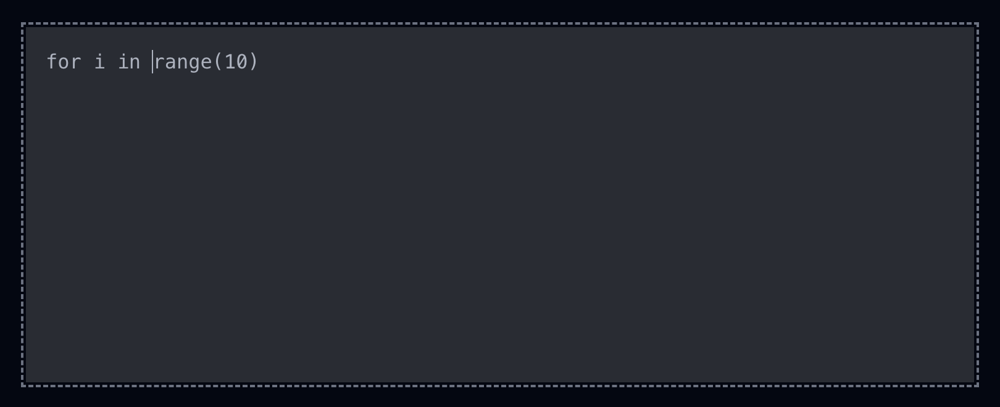
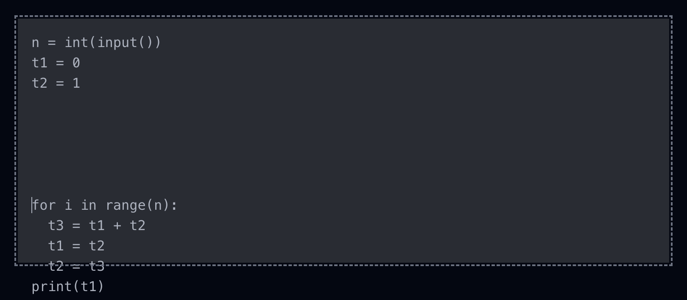
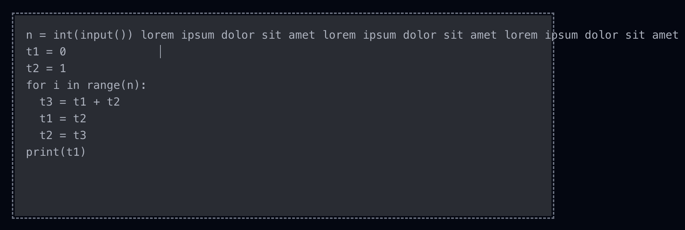
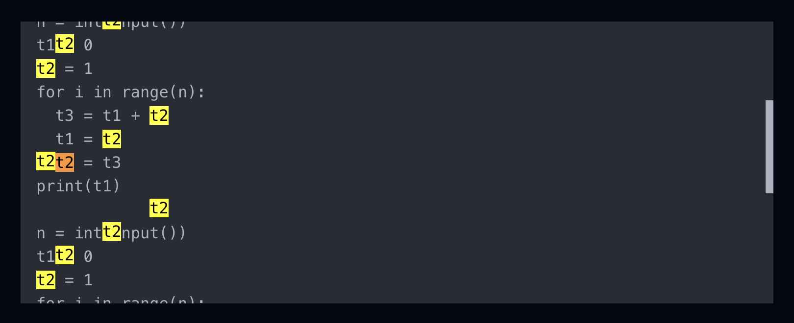

import CodeBlockHeader from '../../components/general/CodeBlockHeader.astro'
import CodeEditorDemo from '../../components/posts/CodeEditorDemo.vue'

Coding my own code editor from scratch, specifically for Markdown, is something I've done a long while ago for my note-taking app [PasteMd](https://pastemd.vercel.app/), and I think it's an interesting little project for someone who wants to dive deep into raw CSS and DOM manipulation. Let's see how I tackled this problem in Vue!

> 🚀 Before writing anything here, I actually have to convert my existing code from Vue 2 to Vue 3. Out of respect for my readers, I can't leave them with such a terrible, antique code. Even though I'd much rather prefer Vue 2 than any version of React.

## 🤔 So, What Do We Want?

Our goal is to create a Vue component similar to a `textarea`, but with code highlighting for the language of our choice. The code written inside this editor should be accessible inside Vue through a custom `v-model`.

But one may wonder --- is it that hard to just add syntax highlighting to a regular `textarea`? Yes, it is. The text inside `textarea` is as plain as it can get. So, just one color, and no partial formatting (e.g., **bold**, _italic_) allowed.

## 🏚️ The HTML Model

The input element, of course, can be nothing else but a `textarea`. However, when it comes to the syntax highlighting, we need to come up with something clever. What if we could just highlight the code in another HTML element, and place it over the `textarea`?

That's pretty close, but won't work. Having another element over the editable zone will make us unable to edit it. The solution is to actually place the highlighted text _under_ the `textarea`, while making the `textarea` text _invisible_. So, let's do just that!

```html
<template>
  <div>
    <pre><code>for i in range(10)</code></pre>
    <textarea name="code-editor" />
  </div>
</template>
```

That's the required HTML to start, with some placeholder Python code.

We have a `pre` element with a `code` child surrounding its content. That's the most accurate way to display preformatted code, semantically speaking. Using just a `pre` tag is not enough to tell the browser --- look, there is some code in a particular programming language. It may be some console output as well, for example.

We also gave a suggestive `name` to the `textarea`, because that's what you do with form elements.

## 🪄 The CSS Magic

Let's make the `pre` and `textarea` elements occupy the same space and sit one on top of the other. We have to deal with some `absolute` and `relative` positions --- that's the reason for putting the two elements inside an outter `div` tag:

```css
div {
  position: relative;
  height: 288px;
}

textarea,
pre {
  position: absolute;
  inset: 0;
  padding: 1rem;
  margin: 0;
}

textarea {
  z-index: 10;
  resize: none;
}

pre {
  user-select: none;
}
```

I chose a somewhat arbitrary editor height of `288px`, and a `z-index` of `10` to make sure the `textarea` is placed above the `pre` element.

Now let's assure that both code blocks use the same typography settings:

```css
textarea,
code {
  font-family: monospace;
  font-size: 1rem;
}
```

And let's make some things become invisible:

```css
textarea {
  color: transparent;
  background-color: transparent;
}
```

While the highlighted code should use some given background and foreground colors:

```css
pre {
  background-color: var(--code-bg);
}

code {
  color: var(--code-fg);
}
```

We can already test the input. For example, by typing _enter_ many times, which will make the `textarea` spawn a scrollbar. But wait, there is no visible cursor!

That's because the default cursor line --- actually, it's called _caret_ --- color is the same as the text color, which in our case is `transparent`. Let's fix that:

```css
textarea {
  caret-color: var(--code-fg);
}
```



There you go.

## 🔌 Defining the Component Props

We'll need a prop telling the component in what programming language its code is written. Why not define it now?

```vue
<script setup lang="ts">
type Props = {
  language: 'markdown' | 'python'
}

defineProps<Props>()
</script>
```

I arbitrarily chose Markdown and Python, just so we can make a choice.

For the moment there's nothing useful to do with this prop. Or is it?

```html
<textarea :name="`${language}-editor`" />
```

## 🛰️ Defining the Component Model

We can already define the component model so that our input gets synchronized between `pre` and `textarea`, and we can get rid of the placeholder code. There's nothing easier than doing that in Vue:

```ts
const model = defineModel<string>()
```

You don't even need an import, since `defineModel` is just a macro.

```html
<pre><code>{{ modelValue }}</code></pre>
<textarea v-model="model" :name="`${language}-editor`" />
```

Let's define an outter component for demo purposes, with a more interesting placeholder:

<CodeBlockHeader title="CodeEditorDemo.vue" />

```vue
<script setup lang="ts">
import { ref } from 'vue'

import CodeEditor from './CodeEditor.vue'

const value = ref(
  [
    'n = int(input())',
    't1 = 0',
    't2 = 1',
    'for i in range(n):',
    '  t3 = t1 + t2',
    '  t1 = t2',
    '  t2 = t3',
    'print(t1)',
  ].join('\n'),
)
</script>

<template>
  <CodeEditor v-model="value" language="python" />
</template>
```

## 🔩 Further CSS Fixes

Now everything (except highlighting) may seem to work. Until you overflow vertically:



Or horizontally (`textarea` wraps, while `pre` does not):



Let's add some good wrapping properties:

```css
textarea,
pre {
  overflow: auto;
  overflow-wrap: break-word;
  white-space: pre-wrap;
}
```

Fixed.

## ↕️ Scroll Syncing

Now notice that when your code overflows vertically, you can't even scroll. Actually, you can, but it's the `textarea` you're scrolling, not the visible `pre` code. To fix this, we need to programatically sync the two elements' scroll positions.

First, define two `ref`s, holding references to the two HTML elements, so we can access their DOM nodes:

```ts
const inputRef = ref<HTMLTextAreaElement>()
const outputRef = ref<HTMLPreElement>()
```

```html
<pre ref="outputRef"><code>{{ modelValue }}</code></pre>
<textarea ref="inputRef" v-model="model" :name="`${language}-editor`" />
```

And then define two scroll-update functions:

```ts
const syncOutputScroll = () => {
  outputRef.value!.scrollTop = inputRef.value!.scrollTop
}
const syncInputScroll = () => {
  inputRef.value!.scrollTop = outputRef.value!.scrollTop
}
```

Which will be called when the `scroll` event fires:

```html
<pre
  ref="outputRef"
  @scroll="syncInputScroll"
><code>{{ modelValue }}</code></pre>
<textarea
  ref="inputRef"
  v-model="model"
  :name="`${language}-editor`"
  @scroll="syncOutputScroll"
/>
```

You may question yourself --- the only element's scroll I can personally interact with is `textarea`, so why do I care what happens when `pre`'s scroll changes?

Well, when you `Ctrl+F` something on the page and the browser gives you results inside the code editor, it will change `pre`'s scroll position without consequences, and you'll end up with things like that:



There's one more bug to be fixed though. Namely, one situation when the two elements' scroll positions are not perfectly synced yet. This happens when a new newline is inserted at the very end, since `pre` works in such a way that it doesn't display trailing newlines. We can fix that by adding a space to the output, which will be invisible to the user:

```ts
const processedCode = computed(() => {
  const code = model.value ?? ''
  return code + (code.at(-1) === '\n' ? ' ' : '')
})
```

Since we're talking about scrolling, notice how the `pre` scrollbar is displayed alongside the `textarea` one. Let's fix that:

```css
pre::-webkit-scrollbar-thumb {
  background-color: transparent;
}

pre::-webkit-scrollbar-corner {
  background-color: transparent;
}
```

Designing the other scrollbar is up to you!

## 🎨 Add Prism Highlighting

We'll use the [Prism](https://prismjs.com/) syntax highlighter to generate the `pre` output:

```sh
npm install prismjs
```

[Generate](https://prismjs.com/download) a theme or just copy/paste mine:

<CodeBlockHeader title="prism.css" />

```css
.token.comment,
.token.prolog,
.token.doctype,
.token.cdata {
  color: hsl(30deg 20% 50%);
}

.token.property,
.token.tag,
.token.boolean,
.token.number,
.token.constant,
.token.symbol {
  color: hsl(350deg 40% 70%);
}

.token.selector,
.token.attr-name,
.token.string,
.token.char,
.token.builtin,
.token.inserted {
  color: hsl(75deg 70% 60%);
}

.token.operator,
.token.entity,
.token.url,
.language-css .token.string,
.style .token.string,
.token.variable {
  color: hsl(40deg 90% 60%);
}

.token.atrule,
.token.attr-value,
.token.keyword {
  color: hsl(350deg 40% 70%);
}

.token.regex,
.token.important {
  color: #e90;
}

.token.important,
.token.bold {
  font-weight: bold;
}

.token.italic {
  font-style: italic;
}

.token.entity {
  cursor: help;
}

.token.deleted {
  color: red;
}
```

Import Prism, the Markdown and Python grammars, and the above stylesheet:

```ts
import prism from 'prismjs'

import 'prismjs/components/prism-markdown'
import 'prismjs/components/prism-python'

import '~styles/prism.css'
```

And do this very odd thing --- your future self will thank you:

```ts
prism.highlightAll = () => {}
```

This is the way I solved, a very long time ago, probably the hardest bug in my entire life. Basically, if I opened my web page in a very peculiar way, the code was getting highlighted twice (the second time, the input became the HTML output of the first time). Responsible for this was this evil function, which is somehow programmed to be automatically called on page refocus or something. So, I had to overwrite it with a function that does nothing.

The actual highlighting process goes like this:

```ts
const highlightedCode = computed(() => {
  try {
    return prism.highlight(
      processedCode.value,
      prism.languages[props.language],
      props.language,
    )
  } catch (error) {
    console.error(error)
    return processedCode
  }
})
```

And the HTML becomes:

```html
<template>
  <div>
    <pre
      ref="outputRef"
      @scroll="syncInputScroll"
    ><code :class="`language-${language}`" v-html="highlightedCode" /></pre>
    <textarea
      ref="inputRef"
      v-model="model"
      :name="`${language}-editor`"
      @scroll="syncOutputScroll"
    />
  </div>
</template>
```

## 🔥 Final Result

<CodeEditorDemo client:visible />

<CodeBlockHeader title="CodeEditor.vue" />

```vue
<script setup lang="ts">
import { computed, ref } from 'vue'
import prism from 'prismjs'

import 'prismjs/components/prism-markdown'
import 'prismjs/components/prism-python'

import '~styles/prism.css'

prism.highlightAll = () => {}

type Props = {
  language: 'markdown' | 'python'
}

const props = defineProps<Props>()

const model = defineModel<string>()

const inputRef = ref<HTMLTextAreaElement>()
const outputRef = ref<HTMLPreElement>()

const syncOutputScroll = () => {
  outputRef.value!.scrollTop = inputRef.value!.scrollTop
}
const syncInputScroll = () => {
  inputRef.value!.scrollTop = outputRef.value!.scrollTop
}

const processedCode = computed(() => {
  const code = model.value ?? ''
  return code + (code.at(-1) === '\n' ? ' ' : '')
})

const highlightedCode = computed(() => {
  try {
    return prism.highlight(
      processedCode.value,
      prism.languages[props.language],
      props.language,
    )
  } catch (error) {
    console.error(error)
    return processedCode
  }
})
</script>

<template>
  <div>
    <pre
      ref="outputRef"
      @scroll="syncInputScroll"
    ><code :class="`language-${language}`" v-html="highlightedCode" /></pre>
    <textarea
      ref="inputRef"
      v-model="model"
      :name="`${language}-editor`"
      @scroll="syncOutputScroll"
    />
  </div>
</template>

<style scoped>
div {
  position: relative;
  height: 288px;
  margin: 2rem 0;
}

textarea,
pre {
  position: absolute;
  inset: 0;
  padding: 1rem;
  margin: 0;
  overflow: auto;
  overflow-wrap: break-word;
  white-space: pre-wrap;
}

textarea,
code {
  font-family: monospace;
  font-size: 1rem;
}

textarea {
  z-index: 10;
  color: transparent;
  caret-color: var(--code-fg);
  resize: none;
  background-color: transparent;
}

pre {
  user-select: none;
  background-color: var(--code-bg);
}

code {
  color: var(--code-fg);
}

pre::-webkit-scrollbar-thumb {
  background-color: transparent;
}

pre::-webkit-scrollbar-corner {
  background-color: transparent;
}
</style>
```

## 🚀 Going Further

You can improve this Vue component by adding event handlers for various key combinations, just like I did [here](https://github.com/gareth618/pastemd/blob/master/components/MarkdownEditor.vue), for PasteMd. That's pretty boring to be honest, so I won't get into the details here.

What you can also do (maybe) is solving the following bug --- make the text inside `pre` unsearchable by the browser on `Ctrl+F`. I didn't manage to, and I noticed that `user-select: none` doesn't do the job.

However, there's only so much you can do with such a raw editor. If you need a serious code editor inside your browser, go ahead and search for ways of [mimicking VSCode](https://github.com/microsoft/monaco-editor).

> 😈 I chose one of the languages of this Vue component to be Python on purpose. You'll see in my next post why.
